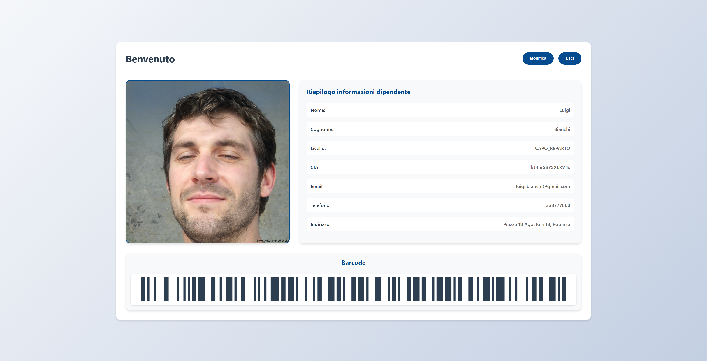

# Design Patterns for Security Demo

Repository del progetto "Design Patterns for Security Demo" sviluppato per la prova intercorso di Tecniche Avanzata di Programmazione, edizione 2024-2025, Università degli Studi della Basilicata, laurea magistrale in Ingegneria informatica e delle tecnologie dell'informazione.

---

## Introduzione

La sicurezza delle applicazioni è un aspetto fondamentale nello sviluppo software, in particolare per le applicazioni che gestiscono dati sensibili e informazioni critiche. 

Lo scopo del presente lavoro è stato quello di analizzare l'impatto dei design pattern sulla sicurezza di un’applicazione web, confrontando due versioni della stessa: una sviluppata senza design pattern e un’altra che implementa pattern mirati a mitigare vulnerabilità comuni.

L'applicazione web sviluppata è un sistema di gestione dell’autenticazione del personale aziendale, che prevede la gestione di tesserini digitali e il loro aggiornamento con diversi livelli di accesso.

L’analisi è stata condotta attraverso test di sicurezza focalizzati sulle vulnerabilità più critiche identificate dall’OWASP Top 10. Per condurre i penetration test è stato utilizzato “Burp Suite”. Attraverso test automatici e manuali, sono stati raccolti dati concreti sulle differenze di sicurezza tra le due implementazioni, permettendo di valutare l’efficacia delle tecniche di protezione adottate.

I metodi di testing impiegati e i risultati ottenuti, evidenziando i vantaggi dell’approccio basato sui design pattern nella prevenzione delle vulnerabilità.

Per ulteriori informazioni consultare il [report](./doc/Relazione%20Progetto%20TAV.pdf) presente nella cartella di progetto dedicata alla documentazione.

---

### **Galleria**

Schermo Login              |  Schermo Dashboard
:-------------------------:|:-------------------------:
  |  

---

### **License**

Questo progetto è concesso in licenza con la licenza MIT, vedere [LICENSE.txt](./LICENSE.txt) per ulteriori informazioni.