```mermaid
graph TD
    %% Sottosezione Vulnerabilità (OWASP Top 10 2021)
    subgraph "Vulnerabilità"
        direction TB
        A01[Broken Access Control A01]
        A02[Cryptographic Failures A02]
        A03[Injection A03]
        A04[Insecure Design A04]
        A05[Security Misconfiguration A05]
        A06[Vulnerable \& Outdated Components A06]
        A07[Identification \& Authentication Failures A07]
        A08[Software \& Data Integrity Failures A08]
        A09[Security Logging \& Monitoring Failures A09]
        A10[SSRF A10]
    end

    %% Sottosezione Design Patterns
    subgraph "Design Patterns"
        direction TB
        DP1[Proxy]
        DP2[Strategy]
        DP3[DAO con Prepared Statement]
        DP4[Decorator]
        DP5[Command]
        DP6[Observer]
        DP7[Adapter]
    end

    %% Nodo per le vulnerabilità non mappate
    subgraph "Non mappate"
        direction TB
        NM[Non definito]
    end

    %% Collegamenti per le vulnerabilità con mapping
    A01 --> DP1
    A02 --> DP2
    A03 --> DP3
    A07 --> DP4
    A08 --> DP5
    A09 --> DP6
    A10 --> DP7

    %% Collegamenti per le vulnerabilità senza mapping
    A04 -.-> NM
    A05 -.-> NM
    A06 -.-> NM

```

# Mappatura tra le vulnerabilità e i design patterns atti a risolverle

Nel seguito viene presentata una possibile mappatura tra alcune delle vulnerabilità individuate dagli standard OWASP Top 10 2021 (integrate, ove possibile, con le “Linee Guida per lo sviluppo sicuro” di AGID in Java) e alcuni Design Pattern che, se applicati correttamente, possono aiutare a mitigare o risolvere tali problematiche. È importante sottolineare che i pattern da soli non garantiscono la sicurezza, ma vanno integrati in un approccio di _security by design_ e _defense in depth_.

## 1. Broken Access Control (OWASP A01:2021)

### **Pattern: Proxy**

**Descrizione:**  
Il **Proxy Pattern** permette di intercettare le chiamate a metodi o accessi a risorse sensibili, inserendo un “filtro” che verifica i privilegi dell’utente prima di inoltrare la richiesta all’oggetto reale. Questo approccio aiuta a garantire che solo utenti autorizzati possano eseguire determinate operazioni. Questo tipo di proxy è chiamato **Protection Proxy** e fa parte dei **Decorator Proxy**.

<div style="page-break-before: always;"></div>

**Esempio di codice Java:**

```java
// Interfaccia che definisce le operazioni sensibili
public interface ISensitiveService {
    void performOperation();
}

// Implementazione concreta del servizio
public class SensitiveService implements ISensitiveService {
    @Override
    public void performOperation() {
        System.out.println("Operazione sensibile eseguita");
    }
}

// Classe Proxy che controlla i permessi prima di delegare la chiamata
public class SensitiveServiceProxy implements ISensitiveService {
    private ISensitiveService serviceImpl;
    private User user; // ipotizzando la presenza di una classe User con metodi di verifica dei ruoli

    public SensitiveServiceProxy(User user) {
        this.user = user;
        this.serviceImpl = new SensitiveService();
    }

    @Override
    public void performOperation() {
        if (user.isAuthenticated() && user.hasRole("ADMIN")) {
            serviceImpl.performOperation();
        } else {
            throw new SecurityException("Accesso negato: privilegi insufficienti");
        }
    }
}
```

<div style="page-break-before: always;"></div>

## 2. Cryptographic Failures (OWASP A02:2021)

### **Pattern: Strategy**

**Descrizione:**  
Lo **Strategy Pattern** consente di definire una famiglia di algoritmi (ad esempio, diversi meccanismi di crittografia) e di selezionarne uno in modo dinamico in base al contesto. Questo approccio permette di cambiare facilmente la strategia di crittografia, o di aggiornare l’algoritmo nel caso divenga obsoleto, senza modificare la logica applicativa.

<div style="page-break-before: always;"></div>

**Esempio di codice Java:**

```java
// Interfaccia della strategia di crittografia
public interface IEncryptionStrategy {
    String encrypt(String data);
}

// Implementazione concreta con algoritmo AES
public class AesEncryptionStrategy implements IEncryptionStrategy {
    @Override
    public String encrypt(String data) {
        // Logica semplificata di crittografia con AES
        return "AES(" + data + ")";
    }
}

// Implementazione concreta con algoritmo DES
public class DesEncryptionStrategy implements EncryptionStrategy {
    @Override
    public String encrypt(String data) {
        // Logica semplificata di crittografia con DES
        return "DES(" + data + ")";
    }
}

// Classe Context che utilizza la strategia scelta
public class EncryptionContext {
    private IEncryptionStrategy strategy;
    
    public EncryptionContext(IEncryptionStrategy strategy) {
        this.strategy = strategy;
    }
    
    public String encryptData(String data) {
        return strategy.encrypt(data);
    }
}
```

<div style="page-break-before: always;"></div>

## 3. Injection (OWASP A03:2021)

### **Pattern: DAO (Data Access Object) con Prepared Statement**

**Descrizione:**  
Il **DAO Pattern** separa la logica di accesso ai dati dal resto dell’applicazione. Utilizzando query parametrizzate (Prepared Statements) all’interno del DAO si evita l’iniezione di codice malevolo, poiché i parametri vengono trattati in modo sicuro.

**Esempio di codice Java:**

```java
public class UserDao {
    private DataSource dataSource;

    public UserDao(DataSource dataSource) {
        this.dataSource = dataSource;
    }
    
    public User getUserById(int id) throws SQLException {
        String sqlQuery = "SELECT * FROM users WHERE id = ?";
        try (Connection conn = dataSource.getConnection();
             PreparedStatement ps = conn.prepareStatement(sqlQuery)) {
            ps.setInt(1, id);
            try (ResultSet rs = ps.executeQuery()) {
                if (rs.next()) {
                    return new User(rs.getInt("id"), rs.getString("username"));
                }
            }
        }
        return null;
    }
}
```

<div style="page-break-before: always;"></div>

## 4. Insecure Design (OWASP A04:2021)

_**~~I have no fucking idea...~~**_

<br/><br/>

## 5. Security Misconfiguration (OWASP A05:2021)

_**~~I have no fucking idea...~~**_

<br/><br/>

## 6. Vulnerable and Outdated Components (OWASP A06:2021)

_**~~I have no fucking idea...~~**_

<div style="page-break-before: always;"></div>

## 7. Identification and Authentication Failures (OWASP A07:2021)

### **Pattern: Decorator**

**Descrizione:**  
Il **Decorator Pattern** risulta utile per consentire l'aggiunta di controlli e funzionalità di sicurezza (ad esempio, rate limiting, logging, meccanismi di lockout dopo tentativi falliti) attorno al processo di autenticazione di base, senza modificarne l'implementazione centrale.


**Esempio di codice Java:**

<div style="page-break-before: always;"></div>

```java
public class BasicAuthenticationService implements AuthenticationService {
    @Override
    public boolean authenticate(String username, String password) {
        // Logica di autenticazione di base (esempio semplificato)
        return "user".equals(username) && "pass".equals(password);
    }
}

public class EnhancedAuthenticationDecorator implements AuthenticationService {
    private AuthenticationService wrappedService;
    
    // Parametri per il controllo dei tentativi
    private int failedAttempts = 0;
    private final int MAX_ATTEMPTS = 5;
    
    // Timestamp dell'ultimo tentativo fallito e durata del lockout (in millisecondi)
    private long lockoutTimestamp = 0;
    private final long LOCKOUT_DURATION = 30000; // 30 secondi

    public EnhancedAuthenticationDecorator(AuthenticationService service) {
        this.wrappedService = service;
    }
    
    @Override
    public boolean authenticate(String username, String password) {
        long currentTime = System.currentTimeMillis();
        
        // Verifica se il numero di tentativi falliti ha raggiunto il limite
        if (failedAttempts >= MAX_ATTEMPTS) {
            // Se il lockout non è ancora terminato, blocca l'autenticazione
            if ((currentTime - lockoutTimestamp) < LOCKOUT_DURATION) {
                long secondsLeft = (LOCKOUT_DURATION - (currentTime - lockoutTimestamp)) / 1000;
                System.out.println("Account bloccato. Riprova dopo " + secondsLeft + " secondi.");
                return false;
            } else {
                // Se il lockout è terminato, resetta il contatore dei tentativi
                failedAttempts = 0;
                lockoutTimestamp = 0;
            }
        }
        
        // Prova l'autenticazione con il servizio di base
        boolean result = wrappedService.authenticate(username, password);
        
        if (!result) {
            // Incrementa il contatore dei tentativi falliti
            failedAttempts++;
            // Se è il primo tentativo fallito, registra il timestamp di inizio lockout
            if (failedAttempts == 1) {
                lockoutTimestamp = currentTime;
            }
            System.out.println("Tentativo fallito (" + failedAttempts + "/" + MAX_ATTEMPTS + ")");
            
            // Se il limite è stato raggiunto, comunica il blocco dell'account
            if (failedAttempts >= MAX_ATTEMPTS) {
                System.out.println("Troppi tentativi falliti. Account bloccato per " + (LOCKOUT_DURATION / 1000) + " secondi.");
            }
        } else {
            // In caso di autenticazione riuscita, resetta il contatore
            failedAttempts = 0;
            lockoutTimestamp = 0;
        }
        
        return result;
    }
}

```

<div style="page-break-before: always;"></div>

## 8. Software and Data Integrity Failures (OWASP A08:2021)

### **Pattern: Command**

**Descrizione:**  
Il **Command Pattern** incapsula una richiesta (o operazione) come un oggetto, permettendo di implementare meccanismi di audit, logging e controlli di integrità su ciascuna operazione eseguita. In questo modo è possibile verificare che le operazioni siano autorizzate e tracciate.

**Esempio di codice (concettuale):**

```java
// Interfaccia per il comando
public interface Command {
    void execute();
}

// Implementazione concreta di un comando
public class UpdateDataCommand implements Command {
    private DataReceiver receiver;
    private String newData;
    
    public UpdateDataCommand(DataReceiver receiver, String newData) {
        this.receiver = receiver;
        this.newData = newData;
    }
    
    @Override
    public void execute() {
        // Logica per aggiornare i dati, includendo eventualmente controlli di integrità
        receiver.update(newData);
        // Possibile logging dell'operazione
    }
}
```

<div style="page-break-before: always;"></div>

## 9. Security Logging and Monitoring Failures (OWASP A09:2021)

### **Pattern: Observer**

**Descrizione:**  
L’**Observer Pattern** permette di implementare un sistema di notifiche per eventi di sicurezza. Quando si verifica un evento rilevante, tutti gli “osservatori” (ad es. componenti di logging o sistemi di monitoraggio) vengono notificati, garantendo una tracciabilità efficace.

**Esempio di codice Java:**

```java
// Interfaccia per gli osservatori degli eventi di sicurezza
public interface ISecurityEventObserver {
    void update(String event);
}

// Implementazione concreta dell'osservatore
public class SecurityLogger implements ISecurityEventObserver {
    @Override
    public void update(String event) {
        System.out.println("Security Log: " + event);
    }
}

// Manager per gli eventi di sicurezza
public class SecurityEventManager {
    private List<SecurityEventObserver> observers = new ArrayList<>();
    
    public void subscribe(SecurityEventObserver observer) {
        observers.add(observer);
    }
    
    public void notifyEvent(String event) {
        for (SecurityEventObserver observer : observers) {
            observer.update(event);
        }
    }
}
```

<div style="page-break-before: always;"></div>

## 10. Server-Side Request Forgery (SSRF) (OWASP A10:2021)

### **Pattern: Adapter**

**Descrizione:**  
L’**Adapter Pattern** permette di “adattare” interfacce non conformi o di intercettare le richieste in uscita. In un contesto di SSRF, l’adapter può essere usato per validare e limitare gli URL a cui possono essere effettuate richieste, riducendo il rischio che richieste non autorizzate vengano inoltrate a server interni o non fidati.

<div style="page-break-before: always;"></div>

**Esempio di codice Java:**

```java
// Interfaccia per un client HTTP
public interface IHttpClient {
    String get(String url);
}

// Classe legacy con una logica HTTP non conforme
public class LegacyHttpClient {
    public String fetch(String url) {
        // Implementazione di base
        return "Risposta da " + url;
    }
}

// Adapter che verifica la validità dell'URL prima di delegare la chiamata
public class HttpClientAdapter implements HttpClient {
    private LegacyHttpClient legacyHttpClient;
    
    public HttpClientAdapter(LegacyHttpClient legacyHttpClient) {
        this.legacyHttpClient = legacyHttpClient;
    }
    
    @Override
    public String get(String url) {
        if (isValidUrl(url)) {
            return legacyHttpClient.fetch(url);
        } else {
            throw new IllegalArgumentException("URL non valido o non autorizzato");
        }
    }
    
    private boolean isValidUrl(String url) {
        // Logica di validazione, ad esempio limitando a domini di fiducia
        return url.startsWith("https://trusted-domain.com");
    }
}
```

<br/><br/>
<div style="page-break-before: always;"></div>


